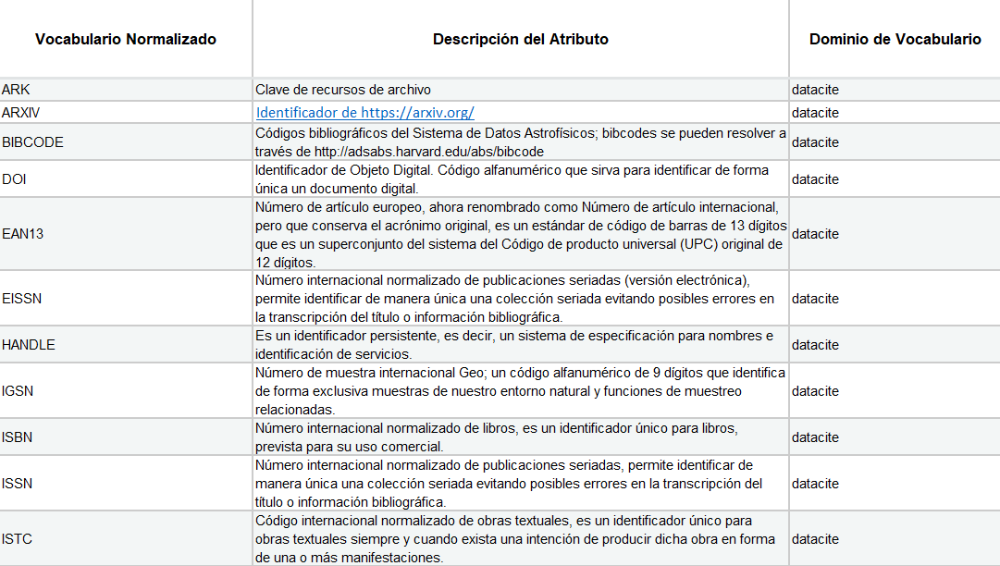
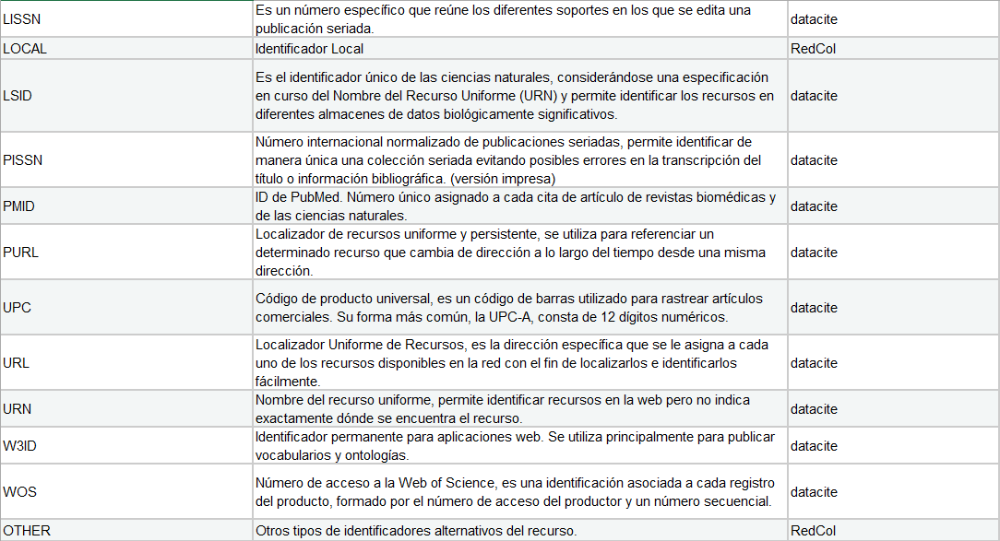

.. _AlternateIdentifier:

Alternate Identifier (Identificador alternativo)(O)
===========

**3.11.1. Nombre según el esquema de metadatos utilizado**

**datacite:alternateIdentifier**

**3.11.2. Etiqueta normalizada (Idioma Español)**

Identificador alternativo

**3.11.3. Definición y alcance de la propiedad**

Un identificador o identificadores distintos del identificador primario aplicado al recurso que se está registrando. Puede ser cualquier cadena alfanumérica que sea única dentro de su dominio de emisión. Puede utilizarse para identificadores locales. Este campo debe usarse para describir distintos identificadores de la misma instancia (misma ubicación, mismo archivo)

**3.11.4. Niveles de persistencia (M/MA/R/O)**

Recomendado (R)

**3.11.5. Niveles de ocurrencia (R / NR**)

Repetible (R): 0-n veces

**3.11.6. Propiedades, atributos y especificadores**

-   **Propiedad Principal Identificadores Alternativos (alternateIdentifiers)(R, 0-n)**: Permite describir distintos identificadores de la misma instancia (misma ubicación, mismo archivo)

    -   **SubPropiedad Identificador Alternativo (alternateIdentifier) (R, 0-n)**: Esta propiedad permite especificar el valor del identificador alternativo que se le ha otorgado al recurso.

        -   **Atributo: Tipo de identificador alternativo (alternateIdentifierType) (M, si alternateIdentifier es utilizado, 1):** Este atributo permite especificar el tipo de identificador alternativo que se le ha otorgado al recurso. Se debe tener en cuenta los siguientes tipos de identificadores y su codificación normalizada según el vocabulario controlado propuesto:

Descargar Tabla [#]_ :download:`xlsx <_Downloads/3.11.6. Propiedades, atributos y especificadores.xlsx>`

**3.11.7. Forma de Descripción Normalizada (RDA / RCAA2 / ISBD)**

-   **Identificador Alternativo:** Identificador del recurso, puede ser una cadena alfanumérica que sea única dentro de su dominio o emisión.

    -   Para el ingreso de ISBN no incluya guiones (-).

    -   Para el caso del PURL, coloque la URL completa.

    -   para el Ingreso de DOI no incluya los datos de la URL (http://doi.org)

    -   Pueden utilizarse para identificadores locales (Signaturas, Códigos de barras, Números de inventarios etc)

**3.11.8. Equivalencias Dublin Core**

-   dc.identifier

-   dc.identifier.doi

-   dc.identifier.local

-   dc.identifier.isbn

-   dc.identifier.issn

-   dc.identifier.uri

-   dc.identifier.url

-   dc.identifier.other

**3.11.9. Ejemplos (XML y DATAVERSE)**

-   Ejemplo XML

..
+-----------------------------------------------------------------------+
| .. image:: _static/image39.png                                        |
|   :scale: 35%                                                         |
|   :name: ejemplo_xml1                                                 |                                
+-----------------------------------------------------------------------+
| .. image:: _static/image40.png                                        |
|   :scale: 35%                                                         |
|   :name: ejemplo_xml2                                                 |                                
+-----------------------------------------------------------------------+
| .. image:: _static/image41.png                                        |
|   :scale: 35%                                                         |
|   :name: ejemplo_xml3                                                 |                                
+-----------------------------------------------------------------------+
..

-   Ejemplo Dataverse

+-----------------------------------------------------------------------+
| .. image:: _static/image42.png                                        |
|   :scale: 35%                                                         |
|   :name: ejemplo_xml3                                                 |                                
+-----------------------------------------------------------------------+
