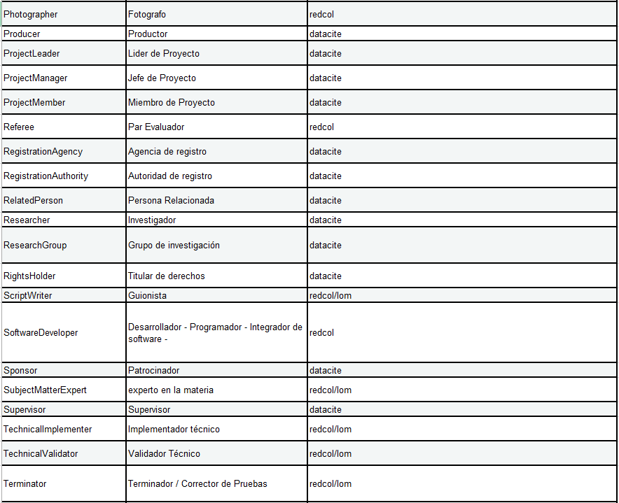

.. _Contributor:

Contributor (Colaborador) (MA / O)
===========

**3.7.1. Nombre según el esquema de metadatos utilizado**

**datacite:contributor**

**3.7.2. Etiqueta normalizada (Idioma Español)**

Colaborador

**3.7.3. Definición y alcance de la propiedad**

Es la entrada secundaria. El campo "Colaborador" define las entidades responsables de contribuir a la creación, desarrollo, gestión y publicación del contenido del recurso. Esta entidad puede ser una persona, una organización o un servicio (máquina).

**3.7.4. Niveles de persistencia (M/MA/R/O)**

Obligatorio si es aplicable a la tipología documental ó si está definido explícitamente en el recurso de información (MA)

**3.7.5. Niveles de ocurrencia(R / NR)**
Repetible (R): 0-n veces. Repita este campo para describir todas las entidades responsables de la creación del recurso en orden prioritario ó de presentación.

**3.7.6. Propiedades, atributos y especificadores**

-   **Propiedad Principal Colaboradores (contributors) (MA, 0-n):** Entidad que agrupa a todos los colaboradores del recurso.

-   **SubPropiedad Colaborador (contributor) (MA, 0-n):** Entidad que identifica cada uno de los colaboradores del recurso.

    -   **Atributo: Tipo de Colaboración (contributorType) (M, 1):** Este atributo, define el rol del colaborador durante el ciclo de vida del mismo. Este campo es obligatorio cuando se define la propiedad "contributor". Se debe tener en cuenta los siguientes tipos de colaboradores y su codificación normalizada según el vocabulario controlado propuesto:

..

-   **SubPropiedad: Nombre Completo del Colaborador (contributorName) (M, 1):** Esta propiedad incluye el texto asociado al colaborador del recurso que debe ser descrito en cualquiera de los formas de descripción propuestas para el campo authorName.

    -   **Atributo: Tipo de Colaborador (nameType) (O, 0-1):** Este atributo permite especificar el tipo de colaborador que se describe en el campo de metadatos. Se debe tener en cuenta los siguientes tipos de colaboradores y su codificación normalizada según el vocabulario controlado propuesto:

..
        +-------------------------+---------------------------------------+----------------------------------------+
        | Vocabulario Normalizado | Descripción del                       | Dominio de Vocabulario                 |
        |                         | Atributo                              |                                        |
        +=========================+=======================================+========================================+
        |  Organizational         | Colaboración Corporativo              | datacite                               |
        +-------------------------+---------------------------------------+----------------------------------------+
        |  Personal               | Colaboración Personal                 | datacite                               |
        +-------------------------+---------------------------------------+----------------------------------------+
        |  Event                  | Colaboración Conferencia - Evento     | redcol                                 |
        +-------------------------+---------------------------------------+----------------------------------------+
        |  Service                | Servicio                              | redcol                                 |
        +-------------------------+---------------------------------------+----------------------------------------+
..

-   **SubPropiedad: Nombres (givenName) (O, 0-1):** Esta propiedad de uso opcional, incluye el texto asociado exclusivamente a los nombres (primer y segundo nombres) del colaborador cuando este se trate de una persona.

-   **SubPropiedad: Apellidos (familyName) (O, 0-1):** Esta propiedad de uso opcional, incluye el texto asociado exclusivamente a los apellidos (primer y segundo apellidos) del colaborador cuando este se trate de una persona.

-   **SubPropiedad: Identificador de Nombre (nameIdentifier) (O, 0-n):** Esta propiedad de uso opcional, incluye el texto asociado que permite identificar de manera unívoca un colaborador como persona natural o corporativa a partir del uso de diversos esquemas de identificación. El formato de texto asociado depende de cada esquema de identificación utilizado. Se debe tener en cuenta los siguientes tipos de identificadores existentes y su codificación normalizada en los atributos de esta propiedad (nameIdentifierScheme), según el vocabulario controlado propuesto (Uso Opcional):

-   **Atributo Nombre del esquema del identificador (nameIdentifierScheme) (M, 1, si es utilizada la propiedad nameIdentifier):** Este atributo permite especificar el nombre del esquema identificador utilizado para describir al colaborador en el campo de metadatos. Se debe tener en cuenta el vocabulario controlado propuesto en la propiedad nameIdentifier.

-   **Atributo URI del esquema del identificador (schemeURI) (M, 1, si es utilizada la propiedad nameIdentifier):** Este atributo permite especificar la URI del nombre del esquema identificador utilizado para describir al colaborador en el campo de metadatos. Se debe tener en cuenta el vocabulario controlado propuesto en la propiedad nameIdentifier

-   **SubPropiedad: Afiliación institucional (affiliation) (O, 0-n):** Esta propiedad de uso opcional, incluye el texto asociado a las distintas afiliación institucionales a las que pertenece el colaborador.

    -   **Atributo Identificador de la organización (affiliationIdentifier) (O,0-n):** Identifica de forma única la afiliación institucional del autor.

    -   **Atributo Nombre del esquema del identificador (affiliationIdentifierScheme) (MA, 1, si es utilizada la propiedad affiliationIdentifier):** Este atributo permite especificar el nombre del esquema identificador utilizado por la afiliación institucional del autor. Se debe tener en cuenta el vocabulario controlado propuesto en la propiedad **nameIdentifier** asociado específicamente para organizaciones/instituciones (ISNI, ROR,etc..)

    -   **Atributo URI del esquema del identificador (SchemeURI) (R, 0-1, si es utilizada la propiedad affiliationIdentifierScheme):** Este atributo permite especificar la URI del nombre del esquema identificador utilizado por la afiliación institucional del autor. Se debe tener en cuenta el vocabulario controlado propuesto en la propiedad **nameIdentifier** asociado específicamente para organizaciones/instituciones (ISNI, ROR,etc..)

**3.7.7. Forma de descripción recomendada**

-   Para nombres personales utilizar el formato invertido de tal forma que la sintaxis sea: "Apellido" + ", " + "Nombre".

-   Para nombre de autores corporativos, donde exista una jerarquía institucional clara, enumerar las partes de la jerarquía de mayor a menor y separarlas con puntos seguidos de un espacio. Si no queda clara la existencia de una jerarquía, o si se desconoce cuál es la parte más grande y más pequeña del cuerpo, facilitar el nombre tal como aparece en la copia electrónica.

-   Para el caso que la colaboración se haya realizado a través de un servicio, se debe describir el nombre del servicio, la versión del servicio, la URL del servicio, el método utilizado y demás elementos que se consideren importantes.

**3.7.8. Equivalencias Dublin Core**

3.7.9. Ejemplos (XML y DATAVERSE)

-   **Ejemplo XML**

-   **Ejemplo XML**

-   **Ejemplo Dataverse (Productor)**

-   **Ejemplo Dataverse (Distintos Roles de Colaboración- Personas)**

