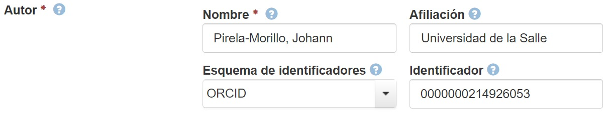

.. _Creator:

Creator (Creador) (M)
===========

**3.2.1. Nombre según el esquema de metadatos utilizado**

**datacite:creator**

**3.2.2. Etiqueta normalizada (Idioma Español)**

Creador - Autor (Personal, Corporativo)

**3.2.3. Definición y alcance de la propiedad**

Esta propiedad describe a los investigadores principales involucrados en la producción de los datos, o los autores de la publicación, en orden de prioridad. En caso de múltiples entidades responsables de la creación del recurso, se debe repetir el elemento tantas veces como sea necesario. Esta propiedad puede describir una persona, una institución o una organización.

**3.2.4. Niveles de persistencia (M/MA/R/O)**

Obligatorio (M)

**3.2.5. Niveles de ocurrencia (R / NR)**

Repetible (R): **1-n veces**. Repita este campo para describir todas las entidades responsables de la creación del recurso en **orden prioritario.**

**3.2.6. Propiedades, atributos y especificadores**

-   **Propiedad Principal Autores "creators" (M, 1-n):** Entidad que agrupa todos los autores del recurso

    -   **Subpropiedad Autor "creator" (M, 1-n)::** Entidad que identifica cada uno de los autores del recurso.

        -   **SubPropiedad: Nombre Completo del Autor (creatorName) (M, 1):** Esta propiedad incluye el texto asociado al autor del recurso en cualquiera de las formas de descripción propuestas.

            -   **Atributo: Tipo de Autor (nameType) (O, 0-1):** Este atributo permite especificar el tipo de autor que se describe en el campo de metadatos. Se debe tener en cuenta los siguientes tipos de autores y su codificación normalizada según el vocabulario controlado propuesto:

                -   **Valores permitidos (vocabularios controlados)**

                ..
                
                +-------------------------+-----------------------------------+
                | Vocabulario Normalizado | Descripción                       |
                +=========================+===================================+
                | Personal                | Autor Personal                    |
                +-------------------------+-----------------------------------+
                | Organizational          | Autor Corporativo                 |
                +-------------------------+-----------------------------------+
                ..

-   **SubPropiedad: Nombres (givenName) (O, 0-1):** Esta propiedad de uso opcional, incluye el texto asociado exclusivamente a los nombres (primer y segundo nombres) del autor personal. Esta propiedad está pensada como un complemento aclaratorio a la propiedad creatorName.

-   **SubPropiedad: Apellidos (familyName) (O, 0-1):** Esta propiedad de uso opcional, incluye el texto asociado exclusivamente a los apellidos (primer y segundo apellidos) del autor personal. Esta propiedad está pensada como un complemento aclaratorio a la propiedad creatorName.

-   **SubPropiedad: Identificador de Nombre (nameIdentifier) (O, 0-n)**: Esta propiedad de uso opcional, incluye el texto asociado que permite identificar de manera unívoca una persona natural o corporativa a partir del uso de diversos esquemas de identificación. Se debe tener en cuenta los siguientes tipos de identificadores existentes y su codificación normalizada en los atributos de esta propiedad (nameIdentifierScheme), según el vocabulario controlado propuesto (Uso Opcional):

    -   **Valores permitidos (vocabularios controlado**

..
                
        +-------------------------+---------------------------------------+----------------------------------------+
        | Vocabulario Normalizado | Esquema de Dominio del                | Descripción del Elemento               |
        | (nameIdentifierScheme)  | Vocabulario (schemeURI)               |                                        |
        +=========================+=======================================+========================================+
        |  EMAIL                  | https://schema.org/email              | Dirección principal de correo          |
        |                         |                                       | electrónico                            |
        +-------------------------+---------------------------------------+----------------------------------------+
        |  FUNDREF                | http://www.crossref.org/fundref/      | Global Research Identifier Database    |
        +-------------------------+---------------------------------------+----------------------------------------+
        |  GRID                   | https://grid.ac/                      | Global Research Identifier Database    |
        +-------------------------+---------------------------------------+----------------------------------------+
        |  IRALISID               | https://www.iralis.org/               | IRA-LIS                                |
        +-------------------------+---------------------------------------+----------------------------------------+
        |  ISNI                   | http://www.isni.org/                  | International Standard Name Identifier |
        |                         |                                       | (ISO 27729)                            |
        +-------------------------+---------------------------------------+----------------------------------------+
        |  LCNAF                  | http://id.loc.gov/authorities/names   | Library of Congress authority ID       |
        |                         |.html                                  |                                        |
        +-------------------------+---------------------------------------+----------------------------------------+
        |  OCLC                   | http://experimental.worldcat.org/fast/| OCLC FAST Authority File               |
        +-------------------------+---------------------------------------+----------------------------------------+
        |  ORCID                  | https://orcid.org                     | Open Researcher and Contributor ID     |
        +-------------------------+---------------------------------------+----------------------------------------+
        |  OTHERS                 |                                       | Incluye: Facebook, Twitter, Mendeley,  |
        |                         |                                       | LinkedIn, BNE, BNC, ResearchGate.      |
        +-------------------------+---------------------------------------+----------------------------------------+
        |  PUBLONS                | https://publons.com                   | Clarivate Analytics Publons ID         |
        +-------------------------+---------------------------------------+----------------------------------------+
        |  RESEARCHID             | https://www.researcherid.com          | Web of Science ResearcherID            |
        +-------------------------+---------------------------------------+----------------------------------------+
        |  ROR                    | https://ror.org/                      |Research Organization Registry Community|
        +-------------------------+---------------------------------------+----------------------------------------+
        |  SCOPUS                 | https://www.scopus.com/freelookup/    | Author ID SCOPUS                       |
        |                         |form/author.uri                        |                                        |
        +-------------------------+---------------------------------------+----------------------------------------+
        |  VIAF                   | https://viaf.org/                     | Virtual International Authority File   |
        +-------------------------+---------------------------------------+----------------------------------------+
..

-   **Atributo Nombre del esquema del identificador (nameIdentifierScheme) (MA, 1, si es utilizada la propiedad nameIdentifier):** Este atributo permite especificar el nombre del esquema identificador utilizado para describir al autor en el campo de metadatos. Se debe tener en cuenta el vocabulario controlado propuesto en la propiedad nameIdentifier.

-   **Atributo URI del esquema del identificador (schemeURI) (R, 0-1, si es utilizada la propiedad nameIdentifierScheme):** Este atributo permite especificar la URI del nombre del esquema identificador utilizado para describir al autor en el campo de metadatos. Se debe tener en cuenta el vocabulario controlado propuesto en la propiedad nameIdentifier.

-   **SubPropiedad: Afiliación institucional (affiliation) (O, 0-n):** Esta propiedad de uso opcional, incluye el texto asociado a las distintas afiliación institucionales a las que pertenece el autor.

    -   **Atributo Identificador de la organización  (affiliationIdentifier) (O,0-n):** Identifica de forma única  la afiliación institucional del autor.

    -   **Atributo Nombre del esquema del identificador (affiliationIdentifierScheme) (MA, 1, si es utilizada la propiedad affiliationIdentifier):** Este atributo permite especificar el nombre del esquema identificador utilizado por la afiliación institucional del autor. Se debe tener en cuenta el vocabulario controlado propuesto en la propiedad **nameIdentifier** asociado específicamente para organizaciones/instituciones (ISNI, ROR,etc..)

    -   **Atributo URI del esquema del identificador (SchemeURI) (R, 0-1, si es utilizada la propiedad affiliationIdentifierScheme):** Este atributo permite especificar la URI del nombre del esquema identificador utilizado por la afiliación institucional del autor. Se debe tener en cuenta el vocabulario controlado propuesto en la propiedad **nameIdentifier** asociado específicamente para organizaciones/instituciones (ISNI, ROR,etc..)

**3.2.7. Forma de Descripción Normalizada (RDA / RCAA2 / ISBD)**

-   Para nombres personales utilizar el formato invertido de tal forma que la sintaxis sea: "Apellido" + ", " + "Nombre".

-   Para nombre de autores corporativos, donde exista una jerarquía institucional clara, enumerar las partes de la jerarquía de mayor a menor y separarlas con puntos seguidos de un espacio.

**3.2.8. Equivalencias Dublin Core**

-   dc.creator

-   dc.contributor.author

-   dc.contributor.corporatename

-   dc.contributor.conferencename

**3.2.9. Ejemplos (XML y DATAVERSE)**

-   **Ejemplo XML (Autores personales)**

-   **Ejemplo XML (Autores Corporativos)**

-   **Ejemplo Dataverse**

    -   **Propiedad Autor**

-   **Atributo Tipos de Identificadores**

