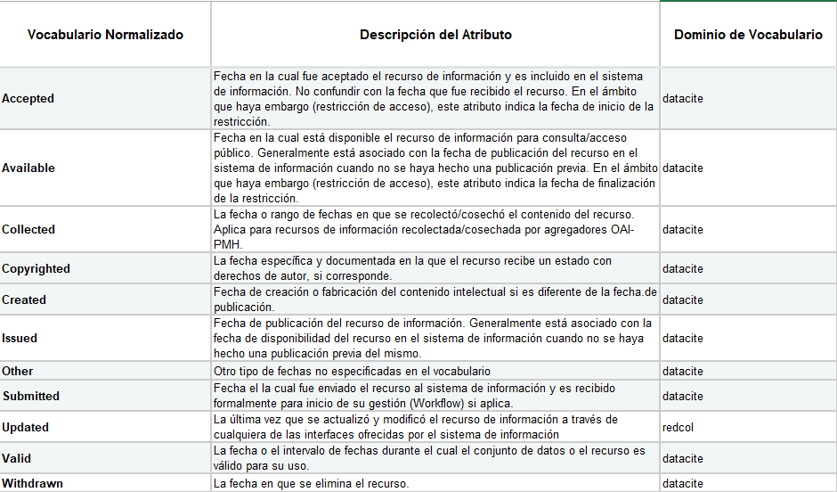
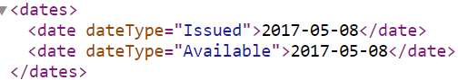
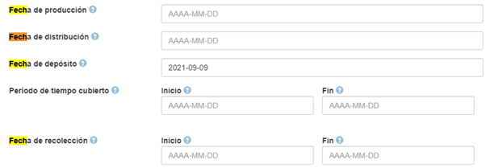

.. _Date:

Date (Fecha)(R)
===========

3.8.1. Nombre según el esquema de metadatos utilizado

**datacite:date**

**3.8.2. Etiqueta normalizada (Idioma Español)**

Fechas asociadas al recurso

**3.8.3. Definición y alcance de la propiedad**

-   Este campo contiene un grupo de fechas asociadas a la creación, edición, publicación, embargo y acceso al recurso de información (Fechas asociadas al evento durante todo el ciclo de vida del recurso).

-   Normalmente, la fecha estará asociada con la disponibilidad del recurso. La mejor práctica es codificar el valor de la fecha con el perfil que define ISO 8601 \[W3CDTF\] con formato AAAA-MM-DD.

-   En caso de recursos de información que se encuentren bajo período de embargo, se deben registrar la fecha de disponibilidad del mismo con el compromiso de proporcionar acceso al documento completo a partir del momento de su liberación (para productos de información que aplique).

**3.8.4. Niveles de persistencia (M/MA/R/O)**

-   Recomendado(R) para aclarar diferentes tipos de fechas cuando se encuentren presentes en el recurso de información.

-   Obligatorio cuando sea aplicable (MA) cuando existan periodos de embargo o restricciones de acceso.

**3.8.5. Niveles de ocurrencia (R / NR)**

-   Repetible (R): 0-n veces

-   Para periodos de embargo: No Repetible (R): 2 ocurrencias (Fechas de inicio y finalización del embargo)

**3.8.6. Propiedades, atributos y especificadores**

-   **Propiedad Principal Fechas (dates)(R,0-n):** Entidad que agrupa todas las fechas relacionadas con el recurso durante su ciclo de vida

    -   **SubPropiedad Fecha (date) (M, 1-n):** Entidad que identifica cada uno de las fechas relacionadas con el recurso durante su ciclo de vida.

        -   **Atributo: Tipo de Fecha (dateType) (M, 1):** En el tipo de fecha elija del vocabulario de tipo de fecha y utilice el término controlado para indicar el tipo de fecha asociado al recurso según el vocabulario propuesto:

   
Descargar Tabla [#]_ :download:`xlsx <_Downloads/8. Date 3.8.6. Propiedades, atributos y especificadores.xlsx>`

**3.8.7. Forma de descripción recomendada**

-   Fecha de publicación completa: Información relacionada con la publicación, impresión, distribución, emisión y puesta en circulación del recurso. Debe ingresarse con las reglas de codificación de la W3C / ISO 8601 para fechas y horas (AAAA-MM-DD) (por ejemplo: 1997-07-16):

-   AAAA \[año de cuatro dígitos\] debería ser obligatorio.

-   MM \[el mes de dos dígitos (01 = enero, 02 = febrero, 03 = marzo,
    > etc.)\] es opcional.

-   DD \[el día del mes de dos dígitos (01 a 31)\] es opcional.

**3.8.8. Equivalencias Dublin Core**

..
+-------------------------+---------------------------------------+
| Campo Dublin Core       | Descripción                           |
+=========================+=======================================+
|  dc.date.issued         | Fecha de publicación                  |
+-------------------------+---------------------------------------+
|  dc.date.available      | Fecha de disponibilidad               |
+-------------------------+---------------------------------------+
|  dc.date.accepted       | Fecha de aceptación                   |
+-------------------------+---------------------------------------+
|  dc.date.submitted      | Fecha de envío                        |
+-------------------------+---------------------------------------+
|  dc.date.created        | Fecha de creación                     |
+-------------------------+---------------------------------------+
|  dc.date.collected      | Fecha de Recolección                  |
+-------------------------+---------------------------------------+
|  dc.date.updated        | Fecha de actualización                |
+-------------------------+---------------------------------------+
|  dc.date.valid          | Fecha de validez                      |
+-------------------------+---------------------------------------+
|  dc.date.withdraw       | Fecha de descarte                     |
+-------------------------+---------------------------------------+
|  dc.date.other          | Otras fechas relacionadas             |
+-------------------------+---------------------------------------+
..

**3.8.9. Ejemplos (XML y DATAVERSE)**

-   **Ejemplo XML**

-   **Ejemplo Dataverse**

