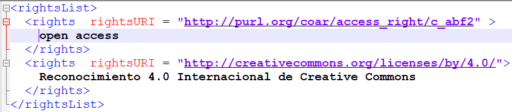

.. _DerechosLicencia:

Derechos de acceso e información de licencia
===========

Respecto a la gestión de los campos asociados con licencias y derechos de acceso, se recomienda utilizar la mayor cantidad de información en los respectivos campos para permitir una mejor experiencia de usuario al declarar los derechos de acceso claros y explícitos en el sistema de información ó repositorio de datos de investigación.

Se recomienda utilizar cómo mínimo los campos de:

-   Derecho de Acceso: URI persistente basada en los vocabularios COAR

-   Licencia: Texto corto que describa brevemente y de forma normalizada la licencia utilizada.

-   URI de la Licencia: URL que enlace un documento digital asociado a la licencia descrita anteriormente.

{width="6.270833333333333in"
height="1.2811482939632546in"}

