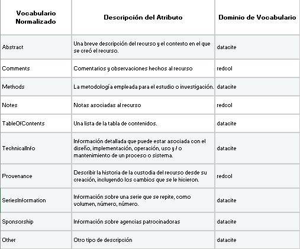
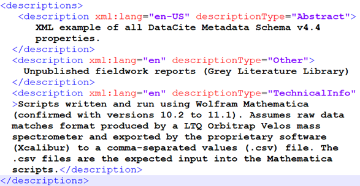
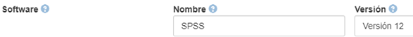
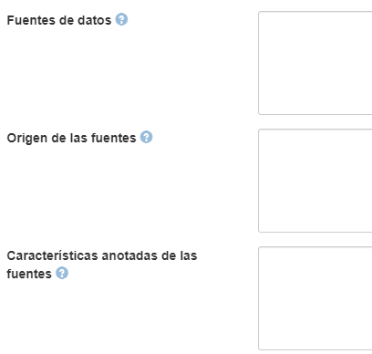

.. _Description:

Description (Descripción)(MA)
===========

**3.17. Description (Descripción)(MA)**

**3.17.1. Nombre según el esquema de metadatos utilizado**

*datacite:description*

**3.17.2. Etiqueta normalizada (Idioma Español)**

Descripción

**3.17.3. Definición y alcance de la propiedad**

Información general o específica del recurso utilizado para la descripción textual. En la descripción se puede incluir resumen, tabla de contenido, representación gráfica del contenido o un texto libre que describa el contenido del recurso.

**3.17.4. Niveles de persistencia (M/MA/R/O)**

Recomendado (R)

**3.17.5. Niveles de ocurrencia (R / NR)**

Repetible (R): 0-n

**3.17.6. Propiedades, atributos y especificadores**

-   *Propiedad Principal Descripciones (descriptions) (R,0-1):* Use la descripción textual como un valor.

-   *SubPropiedad Descripción (description) (R,1-n):* Incluya toda la información adicional que no encaja en ninguna de las otras categorías. Puede utilizarse para información técnica.

    -   *Atributo IDIOMA (xml:lang) (O, 0-1):* Este atributo especifica el idioma utilizado en la descripción. Se debe tener en cuenta su codificación normalizada según el vocabulario propuesto por el estándar ISO 639-3 utilizando carácteres en UTF-8 (https://iso639-3.sil.org/code_tables/download_tables)

    -   *Atributo Tipo de Descripción (descriptionType) (MA, 1):* Este atributo permite especificar el tipo de descripción asociada al recurso. Se debe tener en cuenta los siguientes tipos de descripción y su codificación normalizada según el vocabulario controlado propuesto:

   
Descargar Tabla [#]_ :download:`xlsx <_Downloads/3.17.6. Propiedades, atributos y especificadores.xlsx>`

**3.17.7.Forma de Descripción Normalizada (RDA / RCAA2 / ISBD)**

Revise la forma adecuada para ingresar la información la descripción con
su debida puntuación:

-   *Descripción General:* Texto libre que contiene una descripción general del recurso.

-   *Resumen (Abstract):* Describe el alcance de los contenidos, puede ser un sumario, un resumen, una reseña, una anotación o una frase que describe el recurso. Si la información es tomada textualmente del recurso, se coloca al final del resumen: (Apartes del texto).

-   *Notas (Notes):* Coloque notas generales de interés al público relacionadas con el recurso.

-   *Comentarios (Comments):* Coloque los comentarios generados sobre el recurso omitiendo datos de la entidad que lo generó y fechas de generación.

-   *Tabla de Contenidos (TableOfContents):* Coloque el índice del recurso de información omitiendo números de página y caracteres sin valor semántico (puntos, guiones tabuladores, espacios, etc..)

-   *Métodos (Methods):* Incluya la documentación completa sobre los métodos de la Ciencia Abierta (OpenScience)

**3.17.8. Equivalencias Dublin Core**

-   dc.description

-   dc.description.abstract

-   dc.description.comments

-   dc.description.methods

-   dc.description.notes

-   dc.description.tableofcontents

-   dc.description.technicalinfo

-   dc.description.provenance

-   dc.description.seriesinformation

-   dc.description.sponsorship

-   dc.description.scale

-   dc.description.other

**3.17.9. Ejemplos (XML y DATAVERSE)**

-   *Ejemplo XML*

-   *Ejemplo Dataverse*

