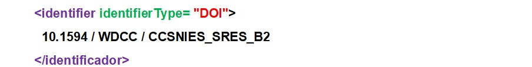

.. _Identifier:

Identifier (Identificador) (M)
===========
**3.1.1. Nombre según el esquema de metadatos utilizado**

**datacite:identifier**

**3.1.2. Etiqueta normalizada (Idioma Español)**

Identificador Digital Persistente del recurso (PID)

**3.1.3. Definición y alcance de la propiedad**

El identificador es una cadena única que identifica un recurso

**3.1.4. Niveles de persistencia (M/MA/R/O)**

Obligatorio (M)

**3.1.5. Niveles de ocurrencia (R / NR)**

Una sola ocurrencia. No repetible (NR).

**3.1.6. Propiedades, atributos y especificadores**

-   **Propiedad Principal "identifier" (Identificador)**

    -   **Atributo "identifierType" ( tipo de identificador) (M,1):** Este atributo permite especificar el tipo de identificador que se le ha otorgado al recurso. Se debe tener en cuenta los siguientes tipos de identificadores y su codificación normalizada según el vocabulario controlado propuesto

        -   **Valores permitidos (vocabularios controlados)**

..
+----------------------------------------+
| Valores de lista controlados (DataCite)|
+========================================+
| DOI (Valor por defecto)                |
+----------------------------------------+

..

..
+----------------------------------------+
| Valores de lista controlados (OpenAIRE)| 
+========================================+
| ARK                                    |
+----------------------------------------+
| DOI                                    |
+----------------------------------------+
| Handle                                 |
+----------------------------------------+
| PURL                                   |
+----------------------------------------+
| URN                                    |
+----------------------------------------+
| URL                                    |
+----------------------------------------+
..
  

**3.1.7. Forma de Descripción Normalizada**

Por defecto, el formato debe ser consistente con un identificador del tipo DOI: \"10.1234/id\"

**3.1.8. Equivalencias Dublin Core**

dc:identifier

**3.1.9. Ejemplos (XML y DATAVERSE)**

-   **Ejemplo XML**

-   **Ejemplo Dataverse**

