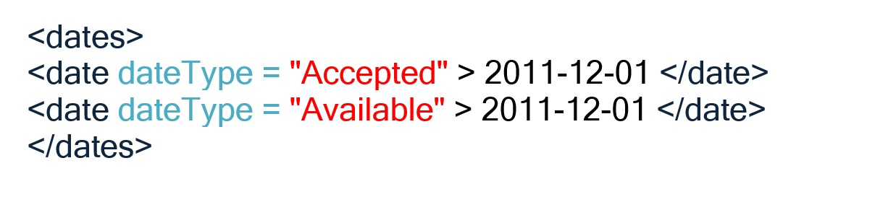

.. _InformacionEmbargo:

Información sobre fechas de embargo
===========

En el caso que los recursos descritos se encuentren bajo período de embargo (restringido su acceso público durante un periodo de tiempo determinado), se deben registrar la fecha de disponibilidad del mismo con el compromiso de proporcionar acceso al recurso de manera irrestricta a partir del momento de su liberación.

En este caso, se deben registrar dos fechas relacionadas:

-   Fecha de inicio (Accepted): fecha \"Aceptada\" para indicar el inicio de un período de embargo.

-   Fecha de finalización(Available): fecha \"Disponible\" para indicar el final de un período de embargo.

