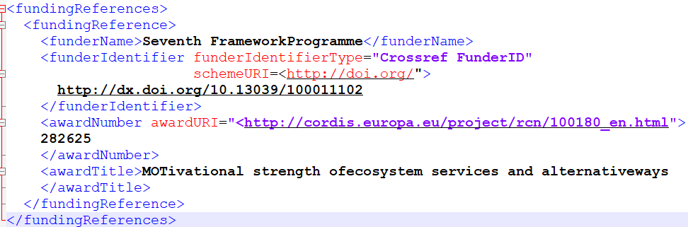

.. _InformacionFinanciacion:

Información de financiación (funder) y patrocinio (sponsor)
===========

Para identificar las fuentes de financiación relacionadas con los datos de investigación. Se recomienda utilizar la propiedad **FundingReference** que contiene las siguientes subpropiedades y atributos: funderName, funderIdentifier, funderIdentifierType, awardNumber, awardURI, awardTitle.

Uno de los principales objetivos de la gestión de datos de investigación, es vincular los resultados de la investigación con la financiación de la investigación. Se recomienda utilizar los campos de financiación, utilizando los identificadores persistentes del financiador que ha financiado total o parcialmente el conjunto de datos descrito (ROR, ISNI, Crossref Funder ID, etc..).

