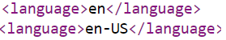
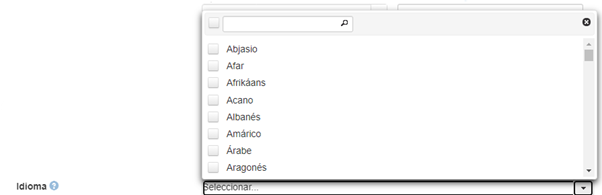

.. _Language:

Language (Idioma)(R)
===========

**3.9.1. Nombre según el esquema de metadatos utilizado**

**datacite:language**

**3.9.2. Etiqueta normalizada (Idioma Español)**

Idioma

**3.9.3. Definición y alcance de la propiedad**

Idioma primario del contenido del recurso de investigación caracterizado por un código normalizado.

**3.9.4. Niveles de persistencia (M/MA/R/O)**

Recomendado (R)

**3.9.5. Niveles de ocurrencia (R / NR)**

Repetible (R): 0-n veces

**3.9.6. Propiedades, atributos y especificadores**

-   Propiedad Principal Idioma (language) (R, 0-n): Entidad que identifica cada uno de los idiomas relacionados con el recurso durante su ciclo de vida. Utilice el término controlado para indicar el tipo de fecha asociado al recurso según el vocabulario propuesto (Norma ISO 639-1 ó la norma IETF BCP 47):

**3.9.7. Forma de descripción recomendada**

-   Revise la forma adecuada para ingresar los códigos referentes al idioma. Existen múltiples vocabularios para normalizar los idiomas como se muestra a continuación:

    - **ETF BCP 47:** Registro de subetiquetas de idioma de IANA. [[https://www.iana.org/assignments/language-subtag-registry/language-subtag-registry]{.ul}](https://www.iana.org/assignments/language-subtag-registry/language-subtag-registry)

    - **ISO 639-1**: http://www.sil.org/iso639-1/

**3.9.8. Equivalencias Dublin Core**

dc.language

**3.9.9. Ejemplos (XML y DATAVERSE)**

-   **Ejemplo XML**

-   **Ejemplo Dataverse**

