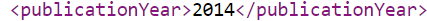

.. _PublicationYear:

PublicationYear (Año de publicación) (M)
===========

**3.5.1. Nombre según el esquema de metadatos utilizado**

**datacite:publicationYear**

**3.5.2. Etiqueta normalizada (Idioma Español)**

Año de Publicación

**3.5.3. Definición y alcance de la propiedad**

En esa propiedad se indica el año (AAAA) en el que los datos se pusieron se pondrán a disposición del público.

**3.5.4. Niveles de persistencia (M/MA/R/O)**

Obligatorio (M) para fechas de publicación.

**3.5.5. Niveles de ocurrencia (R / NR)**

Para fechas de publicación: No Repetible (R): 1 ocurrencia

**3.5.6. Propiedades, atributos y especificadores**

-   Propiedad Principal Año de publicación (publicationYear) **(M, 1)**

**3.5.7. Forma de descripción recomendada**

Fecha de publicación: Escriba únicamente los cuatro dígitos numéricos (AAAA) asociados al año de publicación ó de disponibilidad de los datos.

**3.5.8. Equivalencias Dublin Core**

dc.date.issued

3.5.9. Ejemplos (XML y DATAVERSE)

-   Ejemplo XML

-   Ejemplo Dataverse

