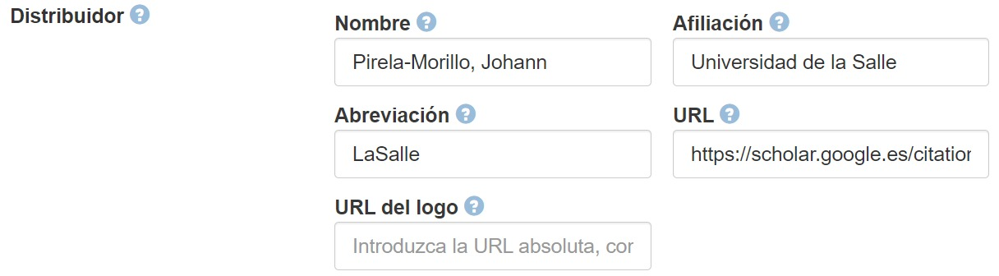

.. _Publisher:

Publisher (Editor) (M)
===========

**3.4.1. Nombre según el esquema de metadatos utilizado**

**datacite:publisher**

**3.4.2. Etiqueta normalizada (Idioma Español)**

Editor, distribuidor, editorial

**3.4.3. Definición y alcance de la propiedad**

Entidad responsable de hacer que el recurso esté disponible. Los editores pueden ser personas, organizaciones o servicios.

**3.4.4. Niveles de persistencia (M/MA/R/O)**

Obligatorio (M)

**3.4.5. Niveles de ocurrencia (R / NR)**

Repetible (R): 0-n veces

**3.4.6. Propiedades, atributos y especificadores**

-   **Propiedad Principal Editor (publisher) (MA, 0-n):** Texto libre. Utilice el nombre del editor como un valor.

**3.4.7. Forma de Descripción Normalizada (RDA / RCAA2 / ISBD)**

-   En el caso de que sea una publicación universitaria, es importante colocar el nombre de la facultad, departamento, área o grupo que corresponda después del nombre de la Universidad. En el caso de identificar un nivel jerárquico utilice como separador el símbolo punto, si son editores diferentes, registre en un nuevo campo. Se recomienda evitar el uso de acrónimos o abreviaturas para la designación de una institución.

**3.4.8. Equivalencias Dublin Core**

-   dc.publisher

-   dc.publisher.place

**3.4.9. Ejemplos (XML y DATAVERSE)**

-   Ejemplo XML

-   Ejemplo Dataverse

