.. _RelatedIdentifier:

RelatedIdentifier (Identificador relacionado)(MA)
===========

**3.12. RelatedIdentifier (Identificador relacionado)(MA)**

**3.12.1. Nombre según el esquema de metadatos utilizado**

*datacite:relatedIdentifier*

**3.12.2. Etiqueta normalizada (Idioma Español)**

Identificador Relacionado

**3.12.3. Definición y alcance de la propiedad**

  - Este campo contiene uno o varios identificadores de recursos relacionados con el recurso que se está describiendo acompañado de una propiedad de relación adjunta según corresponda.

  - Este campo no contiene el Identificador primario del recurso, ni identificadores alternativos del mismo. El uso de este campo es opcional pero recomendado.

  - Las relaciones **Cites** y **IsCitedBy** se utilizan específicamente para cuando una publicación / conjunto de datos cita directamente otra publicación / conjunto de datos en sus referencias, mientras que las relaciones **References** y **IsReferencedBy** son utilizadas cuando un conjunto de datos / publicación se utiliza como fuente de información sin una cita directa.

  - OpenAIRE permite el uso de todos los tipos de relación de DataCite.

**3.12.4. Niveles de persistencia (M/MA/R/O)**

Recomendado (R)

**3.12.5. Niveles de ocurrencia (R / NR)**

Repetible (R) 0-n veces

**3.12.6. Propiedades, atributos y especificadores**

 - **Propiedad Principal Identificadores Relacionados (relatedIdentifiers) (R, 0-n):** Describe uno o varios identificadores normalizados acompañados de un tipo de relación establecida.

    -   **SubPropiedad Identificador Relacionado (relatedIdentifier) (MA,1-n, si está definida la propiedad relatedIdentifiers)**: Esta propiedad permite especificar el valor del identificador relacionado que se le ha otorgado al recurso.

        -   **Atributo: Tipo de identificador relacionado (relatedIdentifierType) (MA, 1 si la propiedad relatedIdentifier es utilizada)**: Este atributo permite especificar el tipo de identificador relacionado al recurso. Se debe tener en cuenta los siguientes tipos de identificadores y su codificación normalizada según el vocabulario controlado propuesto:
 
        ..
 
    +-----------------------------+-----------------------------------------------------------------+-----------------------------+
    | **Vocabulario Normalizado** | **Descripción del Atributo**      			                        | **Dominio de Vocabulario**  | 
    +=============================+=================================================================+=============================+
    | ARK                         | Clave de recursos de archivo				                            | datacite          		      |
    +-----------------------------+-----------------------------------------------------------------+-----------------------------+
    | ARXIV                       | Identificador de https://arxiv.org/                             | datacite  	                |
    +-----------------------------+-----------------------------------------------------------------+-----------------------------+             
    | BIBCODE                     | Códigos bibliográficos del Sistema de Datos Astrofísicos;       | datacite  	                |
    +			                        +	bibcodes se pueden resolver a través de			                  	+		                  	      +  
    |                  			      | http://adsabs.harvard.edu/abs/bibcode	  		                    | 		                        |
    +-----------------------------+-----------------------------------------------------------------+-----------------------------+  
    | DOI                         | Identificador de Objeto Digital. Código alfanumérico que sirva  | datacite                    | 
    +			                        +	para identificar de forma única un documento digital.           +                             +                                         |							                |			      	                                                    |                             |
    +-----------------------------+-----------------------------------------------------------------+-----------------------------+  
    | EANN13                      | Número de artículo europeo, ahora renombrado como Número de     | datacite          		      |
    +			                        +	artículo internacional, pero que conserva el acrónimo original, +  			                      + 	
    |			                        |es un estándar de código de barras de 13 dígitos que es un super |	                  		      |	
    +	                  		      + -conjunto del sistema del Código de producto universal (UPC) 	  +                             +
    |			                        |	original de 12 dígitos.                 			                  |			                        |				
    +-----------------------------+-----------------------------------------------------------------+-----------------------------+ 
    | EISSN                       | Número internacional normalizado de publicaciones seriadas      | datacite     		            |
    +			                        +	(versión electrónica), permite identificar de manera única 	    +  			                      + 	
    |			                        | una colección seriada evitando posibles errores en la 		      |			                        |	
    +			                        + transcripción del título o información bibliográfica. 		      +                             +
    |			                        |	                		                                            |			                        |				
    +-----------------------------+-----------------------------------------------------------------+-----------------------------+  
    | HANDLE         	            | Es un identificador persistente, es decir, un sistema de        | datacite     	      	      |
    +			                        +	especificación para nombres e identificación de servicios.  	  +  			                      + 	
    |			                        | 						                                                		|			                        |	
    +-----------------------------+-----------------------------------------------------------------+-----------------------------+  
    | IGSN                 	      | Número de muestra internacional Geo; un código	alfanumérico	  | datacite     		            |
    +			                        + de 9 dígitos que identifica de forma exclusiva muestras de      + 		                  	    +	
    |			                        | nuestro entorno natural y funciones de muestreo relacionadas	  |			                        |	
    +-----------------------------+-----------------------------------------------------------------+-----------------------------+  
    | ISBN			                  | Número internacional normalizado de libros, es un identificador | datacite     	      	      |
    +			                        +	único para libros, prevista para su uso comercial.		          +                 			      + 	
    |			                        | 					                                                			|	                  		      |	
    +-----------------------------+-----------------------------------------------------------------+-----------------------------+ 			                   
    | ISSN			                  | Número internacional normalizado de publicaciones seriadas,     | datacite     		            |
    +			                        +	permite identificar de manera única una colección seriada	      +  			                      + 	
    |			                        | evitando posibles errores en la transcripción del título o 	    |	                   		      |	
    +	                  		      + información bibliográfica			 		                              +                             +
    |			                        |	                					                                    	|	                   		      |				
    +-----------------------------+-----------------------------------------------------------------+-----------------------------+  
    | ISTC 			                  | Código internacional normalizado de obras textuales, es un      | datacite           		      |
    +			                        +	identificador único para obras textuales siempre y cuando     	+  			                      + 	
    |			                        | exista una intención de producir dicha obra en forma de una 	  |			                        |	
    +			                        + o más manifestaciones.				 		                              +                             +
    |			                        |	                						                                    |			                        |				
    +-----------------------------+-----------------------------------------------------------------+-----------------------------+  
    |LISSN 			                  | Es un número específico que reúne los diferentes	              | datacite           		      |
    +	                  		      +	soportes en los que se edita una publicación seriada.		        +                  			      + 	
    |			                        | 							                                                	|	                  		      |	
    +-----------------------------+-----------------------------------------------------------------+-----------------------------+  
    | LOCAL			                  | Identificador Local					                                    | RedCol	                    |
    +-----------------------------+-----------------------------------------------------------------+-----------------------------+  
    | LSID 			                  | Es el identificador único de las ciencias naturales,		        | datacite          		      |
    +			                        +	considerándose una especificación en curso del Nombre		        +  			                      + 	
    |			                        | del Recurso Uniforme (URN) y permite identificar los 		        |			                        |	
    +			                        + recursos en diferentes almacenes de datos biológicamente        +                             +
    |			                        |	significativos.           					                            |			                        |				
    +-----------------------------+-----------------------------------------------------------------+-----------------------------+  
    | PISSN			                  | Número internacional normalizado de publicaciones	              | datacite     	      	      |
    +			                        +	seriadas, permite identificar de manera única una colección	    +  			                      + 	
    |			                        | seriada evitando posibles errores en la transcripción del	      |		                          |	
    +	  		                      + título o información bibliográfica. (versión impresa) 		      +                             +
    |			                        |	                					                                    	|			                        |				
    +-----------------------------+-----------------------------------------------------------------+-----------------------------+                                         | PMID 			                  |ID de PubMed. Número único asignado a cada cita de 		          | datacite     		            |
    +			                        +	artículo de revistas biomédicas y de las ciencias naturales.	  +  			                      +  	
    |			                        | 								                                                |			                        |	
    +-----------------------------+-----------------------------------------------------------------+-----------------------------+                                  
    | PURL			                  | Localizador de recursos uniforme y persistente, se utiliza      | datacite          		      |
    +			                        +	para referenciar un determinado recurso que cambia de	        	+  			                      + 	
    |			                        | dirección a lo largo del tiempo desde una misma dirección.	    |			                        |	
    +-----------------------------+-----------------------------------------------------------------+-----------------------------+  
    | UPC 			                  | Código de producto universal, es un código de barras		        | datacite          		      |
    +			                        +	utilizado para rastrear artículos comerciales. Su forma más	    +  			                      + 	
    |			                        | común, la UPC-A, consta de 12 dígitos numéricos.		            |			                        |	
    +-----------------------------+-----------------------------------------------------------------+-----------------------------+  
    | URL			                    | Localizador Uniforme de Recursos, es la dirección específica    | datacite     	      	      |
    +			                        +	que se le asigna a cada uno de los recursos disponibles		      +                 			      + 	
    |			                        | en la red con el fin de localizarlos e identificarlos 		      |	                  		      |	
    +			                        + fácilmente.						 	                                        +                             +
    |			                        |	                						                                    |	                  		      |				
    +-----------------------------+-----------------------------------------------------------------+-----------------------------+  
    | URN			                    | Nombre del recurso uniforme, permite identificar recursos       | datacite     		            |
    +			                        +	en la web pero no indica exactamente dónde se encuentra		      +  			                      + 	
    |			                        | el recurso							                                        |			                        |	
    +-----------------------------+-----------------------------------------------------------------+-----------------------------+  
    | W3ID			                  | Identificador permanente para aplicaciones web. Se utiliza      | datacite          		      |
    +			                        +	principalmente para publicar vocabularios y ontologías.		      +  			                      + 	
    |			                        | 							                                                	|			                        |	
    +-----------------------------+-----------------------------------------------------------------+-----------------------------+  
    | WOS			                    | Número de acceso a la Web of Science, es una identificación     | datacite     		            |
    +			                        +	asociada a cada registro del producto, formado por el número   	+  			                      + 	
    |			                        | de acceso del productor y un número secuencial.			            |			                        |	
    +-----------------------------+-----------------------------------------------------------------+-----------------------------+  
    | OTHER			                  | Otros tipos de identificadores alternativos del recurso.        | RedCol    		              |
    +-----------------------------+-----------------------------------------------------------------+-----------------------------+  

        ..
        

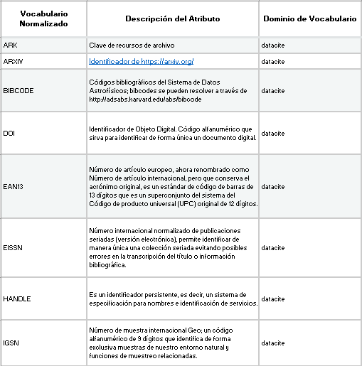

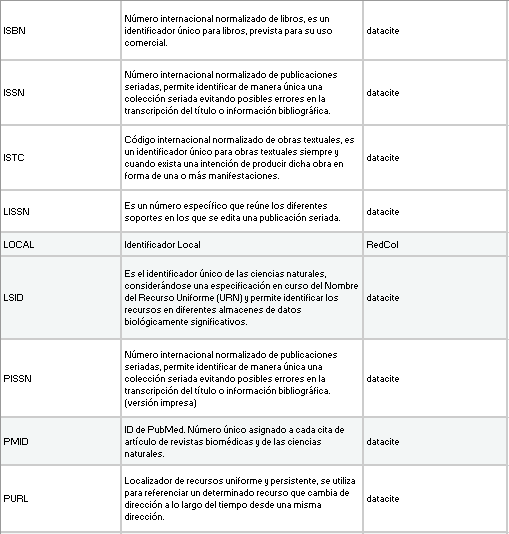

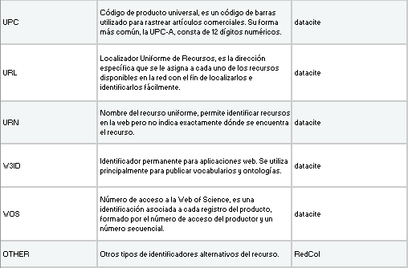
   
   
   
Descargar Tabla [#]_ :download:`xlsx <_Downloads/3.12.6. Propiedades, atributos y especificadores - relatedIdentifierType.xlsx>`

       -   **Atributo: Tipo de Relación (relationType) (MA, 1 si la propiedad relatedIdentifier es utilizada):** Este atributo permite describir la relación del recurso que se está describiendo (A) con otro recurso relacionado (B). Se debe tener en cuenta los siguientes tipos de relación y su codificación normalizada según el vocabulario controlado propuesto:

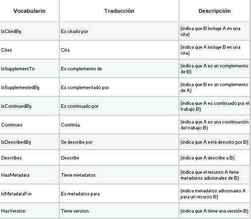

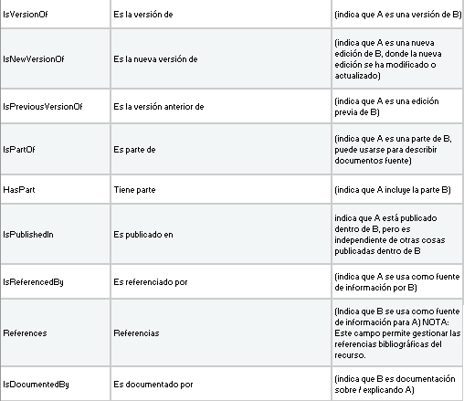

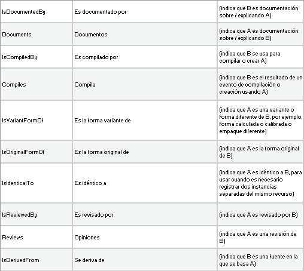

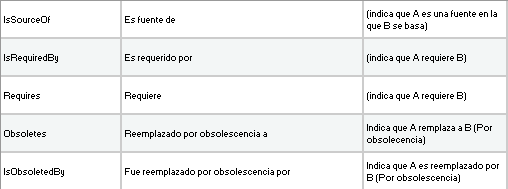

  
Descargar Tabla [#]_ :download:`xlsx <_Downloads/3.12.6. Propiedades, atributos y especificadores - relationType.xlsx>`

       -   **Atributo: Esquema de metadatos relacionado (relatedMetadataScheme) (O, 0-1):** Este atributo permite establecer un esquema de metadatos utilizado para describir la relación del identificador. Este atributo debe ser únicamente utilizado si el atributo anterior **relationType** es utilizado y este contiene los valores (HasMetadata/IsMetadataFor).

       -   **Atributo: URI del esquema de metadatos relacionado (schemeURI) (O, 0-1):** Este atributo permite establecer la URI normalizada del esquema de metadatos utilizado para describir la relación del identificador en un formato estándar (XSD,DDT, Turtle). Este atributo debe ser únicamente utilizado si el atributo anterior **relationType** es utilizado y este contiene los valores (HasMetadata/IsMetadataFor).

       -   **Atributo: Tipo de esquema de metadatos relacionado (schemeType) (O, 0-1):** Este atributo contiene el tipo de formato del esquema de metadatos que fue vinculado en el atributo anterior **schemeURI** (XSD,DDT, Turtle). Este atributo debe ser únicamente utilizado si el atributo anterior **relationType** es utilizado y este contiene los valores (HasMetadata/IsMetadataFor).

       -   **Atributo: Tipo de contenidos en el recurso relacionado (resourceTypeGeneral) (O, 0-1):** Este campo describe el tipo de contenidos que se encuentran en el recurso relacionado. Se debe tener en cuenta los mismos tipos de contenidos de Tipología y Naturaleza del Contenido del Recurso indicados según el vocabulario controlado provisto por DataCite (**resourceTypeGeneral**):

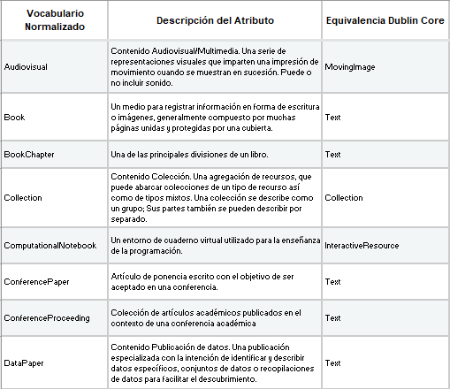

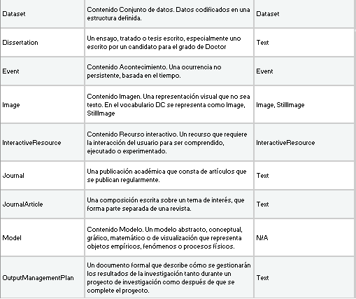

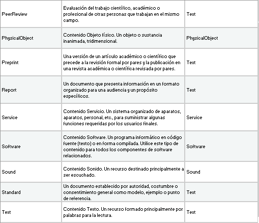

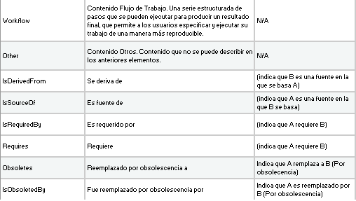

Descargar Tabla [#]_ :download:`xlsx <_Downloads/3.12.6. Propiedades, atributos y especificadores - resourceTypeGeneral.xlsx>`

**3.12.7. Forma de Descripción recomendada**

**3.12.8. Equivalencias Dublin Core**

    -   dc.relation

    -   dc.relation.iscitedby

    -   dc.relation.cites

    -   dc.relation.issupplementto

    -   dc.relation.issupplementedby

    -   dc.relation.iscontinuedby

    -   dc.relation.continues

    -   dc.relation.isdescribedby

    -   dc.relation.describes

    -   dc.relation.hasmetadata

    -   dc.relation.ismetadatafor

    -   dc.relation.hasversion

    -   dc.relation.isversionof

    -   dc.relation.isnewversionof

    -   dc.relation.ispreviousversionof

    -   dc.relation.ispartof

    -   dc.relation.ispartofseries

    -   dc.relation.haspart

    -   dc.relation.isreferencedby

    -   dc.relation.references

    -   dc.relation.isdocumentedby

    -   dc.relation.documents

    -   dc.relation.iscompiledby

    -   dc.relation.compiles

    -   dc.relation.isvariantformof

    -   dc.relation.isoriginalformof

    -   dc.relation.isidenticalto

    -   dc.relation.isreviewedby

    -   dc.relation.reviews

    -   dc.relation.isderivedfrom

    -   dc.relation.issourceof

    -   dc.relation.isrequiredby

    -   dc.relation.requires

**3.12.9. Ejemplos (XML y DATAVERSE)**

-   Ejemplo XML
..
                           
+-----------------------------------------------------------------------+
| .. image:: _static/image1002.jpg                                      |
|   :scale: 35%                                                         |
|   :name: ejemplo_xml3                                                 |                                
+-----------------------------------------------------------------------+
..

-   Ejemplo Dataverse
..
+-----------------------------------------------------------------------+
| .. image:: _static/image12_15.png                                     |
|   :scale: 35%                                                         |
|   :name: ejemplo_xml2                                                 |                                
+-----------------------------------------------------------------------+
| .. image:: _static/image12_16.png                                     |
|   :scale: 35%                                                         |
|   :name: ejemplo_xml3                                                 |                                
+-----------------------------------------------------------------------+
..
