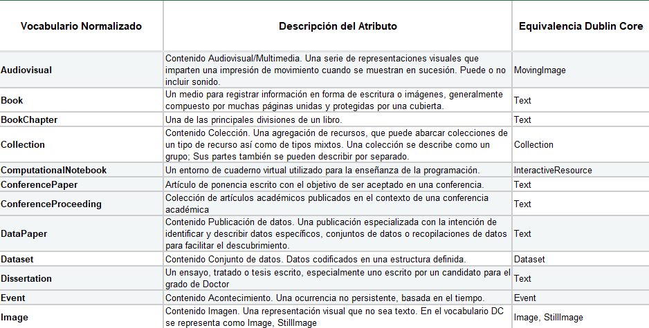
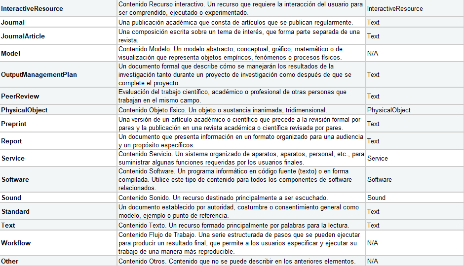

.. _ResourceType:

ResourceType (Tipo de datos) (M)
===========

**3.10.1. Nombre según el esquema de metadatos utilizado**

**datacite:resourceType**

**3.10.2. Etiqueta normalizada (Idioma Español)**

Tipología del Recurso (Tipo de datos)

**3.10.3. Definición y alcance de la propiedad**

-   Esta propiedad describe el tipo y naturaleza asociado al contenido del recurso. Se recomienda utilizar para esta propiedad valores tomados de vocabularios controlados:

    -   Vocabulario de Tipología Documental Normalizada COAR (M,1): Hace referencia al tipo de publicación basándose en un vocabulario controlado normalizado, el cual es utilizado por el usuario para identificar la categoría asociada al recurso que está mostrando.

**3.10.4. Niveles de persistencia (M/MA/R/O)**

-   Tipología Documental Normalizada COAR: Obligatorio (M,1)

-   Naturaleza del contenido DataCite (resourceTypeGeneral): Obligatorio (M,1)

**3.10.5. Niveles de ocurrencia (R / NR)**

Repetible (R) según los distintos contextos de aplicación de la tipología documental asociada.

**3.10.6. Propiedades, atributos y especificadores**

-   **Propiedad Principal Tipo de recurso de datos (resourceType) (M,1-n):** Utilice una etiqueta de texto libre para identificar el tipo de recurso como valor. Aunque se puede utilizar una etiqueta en cualquier idioma, se recomienda utilizar las etiquetas preferidas (Preferred Labels) establecidas en el vocabulario de tipologías **COAR versión 3.0** (2021b).

    -   **Atributo Tipología y Naturaleza del contenido DataCite (resourceTypeGeneral) (M,1):** Este atributo permite especificar el tipo de contenido asociado a la tipología documental descrita del recurso de información. Se debe tener en cuenta los siguientes tipos de contenido y su codificación normalizada según el vocabulario controlado propuesto por DataCite.

    -   **Atributo URI del identificador de la tipología COAR (resourceTypeCOAR)(R,1):** Este atributo permite especificar la URI asociada a la tipología documental normalizada según el **vocabulario de tipologías** **COAR versión 3.0,** en especial las tipologías adaptadas para datos de investigación (dataset).

**3.10.7. Forma de descripción recomendada**

-   Revise la forma adecuada para seleccionar el tipo de recurso, se recomienda utilizar los vocabularios de tipologías documentales de COAR y de Tipologías de DataCite.

     -**Tipología y Naturaleza del Contenido del Recurso:** Se debe seleccionar el tipo de contenido del recurso según vocabulario controlado provisto por DataCite (**resourceTypeGeneral**):

  
Descargar Tabla [#]_ :download:`xlsx <_Downloads/3.10. ResourceType 3.10.7. Forma de descripción recomendada.xlsx>`

-   **Tipología Documental Normalizada COAR para Datos de investigación:** Se debe seleccionar la etiqueta normalizada (término preferido) que corresponda con el tipo de recurso. Así mismo debe estar debidamente relacionado con una URI asociada del tipo PURL. Las tipologías adaptadas para datos de investigación (dataset) son:

..

+--------------+----------------+----------------------------------------------+----------------------------------+
|              |                |                                              |                                  |
| Concepto     | Etiqueta       | URI                                          | Descripción                      |
| Término      | en             | (resource                                    |                                  |
| Preferido    | español        | TypeCOAR)                                    |                                  |
|              |                |                                              |                                  |
|              |                |                                              |                                  |
| (resource    |                |                                              |                                  |
| Type)        |                |                                              |                                  |
+==============+================+==============================================+==================================+
| dataset      | conjunto       | http://purl.org/coar/resource_type/c_ddb1    | Una colección de hechos y datos  |
|              | de datos       |                                              | relacionados codificados en una  |
|              |                |                                              | estructura definida.             |
|              |                |                                              |                                  |
|              |                |                                              |                                  |
|              |                |                                              |                                  |
|              |                |                                              |                                  |
|              |                |                                              |                                  |
|              |                |                                              |                                  |
|              |                |                                              |                                  |
|              |                |                                              |                                  |
+--------------+----------------+----------------------------------------------+----------------------------------+
| aggregated   | datos          | http://purl.org/coar/resource_type/ACF7-8YT9 | Estadísticas que se relacionan   |
|              | agregados      |                                              | con clases, grupos o categorías  |
| data         |                |                                              | generales. Los datos se          |
|              |                |                                              | promedian, se suman o se derivan |
|              |                |                                              | de otro modo de datos a nivel    |
|              |                |                                              | individual, y ya no es posible   |
|              |                |                                              | distinguir las características   |
|              |                |                                              | de los individuos dentro de esas |
|              |                |                                              | clases, grupos o categorías.     |
|              |                |                                              |                                  |
|              |                |                                              |                                  |
+--------------+----------------+----------------------------------------------+----------------------------------+
| clinical     | ensayo         | http://purl.org/coar/resource_type/c_cb28    | Datos resultantes de un estudio  |
| trial        | clínico        |                                              | de investigación en el que uno o |
| data         |                |                                              | más sujetos humanos se asignan   |
|              |                |                                              | prospectivamente a una o más     |
|              |                |                                              | intervenciones (que pueden       |
|              |                |                                              | incluir placebo u otro control)  |
|              |                |                                              | para evaluar los efectos de esas |
|              |                |                                              | intervenciones en los resultados |
|              |                |                                              | biomédicos o conductuales        |
|              |                |                                              | relacionados con la salud.       |
|              |                |                                              |                                  |
+--------------+----------------+----------------------------------------------+----------------------------------+
| compiled     | datos          | http://purl.org/coar/resource_type/FXF3-D3G7 | Los datos recopilados o reunidos |
| data         | compilados     |                                              | a partir de fuentes múltiples, a |
|              |                |                                              | menudo heterogéneas, que tienen  |
|              |                |                                              | uno o más puntos de referencia   |
|              |                |                                              | en común, y al menos una de las  |
|              |                |                                              | fuentes se produjo originalmente |
|              |                |                                              | para otros fines.                |
|              |                |                                              |                                  |
|              |                |                                              |                                  |
|              |                |                                              |                                  |
|              |                |                                              |                                  |
+--------------+----------------+----------------------------------------------+----------------------------------+
| encoded      | datos          | http://purl.org/coar/resource_type/AM6W-6QAW | Los datos cualitativos           |
| data         | codificados    |                                              | (textuales, video, audio o       |
|              |                |                                              | imágenes fijas) originalmente    |
|              |                |                                              | producidos para otros propósitos |
|              |                |                                              | en datos cuantitativos           |
|              |                |                                              | (expresados en matrices unidad   |
|              |                |                                              | por variable) mediante el uso de |
|              |                |                                              | técnicas de codificación de      |
|              |                |                                              | acuerdo con esquemas de          |
|              |                |                                              | categorización predefinidos.     |
|              |                |                                              |                                  |
+--------------+----------------+----------------------------------------------+----------------------------------+
| experimental | datos          | http://purl.org/coar/resource_type/63NG-B465 | Datos resultantes del método de  |
|              | exper          |                                              | investigación experimental que   |
| data         | imentales      |                                              | implica la manipulación de       |
|              |                |                                              | algunas o todas las variables    |
|              |                |                                              | independientes incluidas en las  |
|              |                |                                              | hipótesis.                       |
|              |                |                                              |                                  |
|              |                |                                              |                                  |
|              |                |                                              |                                  |
|              |                |                                              |                                  |
|              |                |                                              |                                  |
+--------------+----------------+----------------------------------------------+----------------------------------+
| genomic      | datos          | http://purl.org/coar/resource_type/A8F1-NPV9 | Los datos genómicos se refieren  |
| data         | genómicos      |                                              | a los datos del genoma y del ADN |
|              |                |                                              | de un organismo. Se utilizan en  |
|              |                |                                              | bioinformática para recolectar,  |
|              |                |                                              | almacenar y procesar los genomas |
|              |                |                                              | de los seres vivos. Los datos    |
|              |                |                                              | genómicos son un término más     |
|              |                |                                              | extenso que los datos de         |
|              |                |                                              | secuenciación. Sin embargo, los  |
|              |                |                                              | datos genómicos provienen        |
|              |                |                                              | principalmente de técnicas de    |
|              |                |                                              | secuenciación. Puede incluir     |
|              |                |                                              | datos sin secuenciación, como    |
|              |                |                                              | datos de microarrays, datos de   |
|              |                |                                              | paneles de PCR en tiempo real y  |
|              |                |                                              | datos de estudios                |
|              |                |                                              | farmacogenómicos.                |
+--------------+----------------+----------------------------------------------+----------------------------------+
| geospatial   | datos          | http://purl.org/coar/resource_type/2H0M-X761 | Los datos geoespaciales          |
|              | geoespaciales  |                                              | discretos generalmente se        |
| data         |                |                                              | representan utilizando datos     |
|              |                |                                              | vectoriales que consisten en     |
|              |                |                                              | puntos, líneas y polígonos,      |
|              |                |                                              | mientras que los datos           |
|              |                |                                              | geoespaciales continuos          |
|              |                |                                              | generalmente se representan      |
|              |                |                                              | mediante datos ráster, que       |
|              |                |                                              | consisten en una cuadrícula de   |
|              |                |                                              | celdas que cada una tiene su     |
|              |                |                                              | propio valor.                    |
+--------------+----------------+----------------------------------------------+----------------------------------+
| laboratory   | cuaderno       | http://purl.org/coar/resource_type/H41Y-FW7B | Un cuaderno de laboratorio es un |
|              | de             |                                              | registro principal de la         |
| notebook     | laboratorio    |                                              | investigación. Los               |
|              |                |                                              | investigadores utilizan un       |
|              |                |                                              | cuaderno de laboratorio para     |
|              |                |                                              | documentar sus hipótesis,        |
|              |                |                                              | experimentos y análisis o        |
|              |                |                                              | interpretación inicial de estos  |
|              |                |                                              | experimentos.                    |
|              |                |                                              |                                  |
|              |                |                                              |                                  |
+--------------+----------------+----------------------------------------------+----------------------------------+
| measurement  | datos de       | http://purl.org/coar/resource_type/DD58-GFSX | Datos que resultan de evaluar    |
| and test     | medición       |                                              | propiedades (o características)  |
| data         | y prueba       |                                              | específicas de seres, cosas,     |
|              |                |                                              | fenómenos (y / o procesos)       |
|              |                |                                              | mediante la aplicación de        |
|              |                |                                              | estándares preestablecidos y / o |
|              |                |                                              | instrumentos o técnicas          |
|              |                |                                              | especializadas.                  |
|              |                |                                              |                                  |
|              |                |                                              |                                  |
|              |                |                                              |                                  |
+--------------+----------------+----------------------------------------------+----------------------------------+
| observational| datos          | http://purl.org/coar/resource_type/FF4C-28RK | Datos resultantes de la          |
| data         | observacionales|                                              | investigación observacional, que |
|              |                |                                              | implica recopilar observaciones  |
|              |                |                                              | a medida que ocurren (por        |
|              |                |                                              | ejemplo, observar                |
|              |                |                                              | comportamientos, eventos,        |
|              |                |                                              | desarrollo de afecciones o       |
|              |                |                                              | enfermedades, etc.), sin         |
|              |                |                                              | intentar manipular ninguna de    |
|              |                |                                              | las variables independientes.    |
|              |                |                                              |                                  |
+--------------+----------------+----------------------------------------------+----------------------------------+
| recorded     | datos          | http://purl.org/coar/resource_type/CQMR-7K63 | Datos registrados por medios     |
| data         | registrados    |                                              | mecánicos o electrónicos, en una |
|              |                |                                              | forma que permita recuperar y /  |
|              |                |                                              | o reproducir la información. Por |
|              |                |                                              | ejemplo, imágenes o sonidos en   |
|              |                |                                              | disco o cinta magnética.         |
|              |                |                                              |                                  |
|              |                |                                              |                                  |
|              |                |                                              |                                  |
|              |                |                                              |                                  |
|              |                |                                              |                                  |
+--------------+----------------+----------------------------------------------+----------------------------------+
| simulation   | datos de       | http://purl.org/coar/resource_type/W2XT-7017 | Datos que resultan del modelado  |
|              | simulación     |                                              | o la representación imitativa de |
| data         |                |                                              | procesos, eventos o sistemas del |
|              |                |                                              | mundo real, a menudo utilizando  |
|              |                |                                              | programas de computadora.        |
|              |                |                                              |                                  |
|              |                |                                              |                                  |
|              |                |                                              |                                  |
|              |                |                                              |                                  |
|              |                |                                              |                                  |
|              |                |                                              |                                  |
+--------------+----------------+----------------------------------------------+----------------------------------+
| survey       | datos de       | http://purl.org/coar/resource_type/NHD0-W6SY | Datos resultantes de una         |
| data         | encuesta       |                                              | encuesta, que se define como una |
|              |                |                                              | investigación sobre las          |
|              |                |                                              | características de una           |
|              |                |                                              | determinada población mediante   |
|              |                |                                              | la recolección de datos de una   |
|              |                |                                              | muestra de esa población y la    |
|              |                |                                              | estimación de sus                |
|              |                |                                              | características mediante el uso  |
|              |                |                                              | sistemático de metodología       |
|              |                |                                              | estadística. Se incluyen censos, |
|              |                |                                              | encuestas por muestreo,          |
|              |                |                                              | recopilación de datos de         |
|              |                |                                              | registros administrativos y      |
|              |                |                                              | actividades estadísticas         |
|              |                |                                              | derivadas, así como              |
|              |                |                                              | cuestionarios.                   |
+--------------+----------------+----------------------------------------------+----------------------------------+

..

**3.10.8. Equivalencias Dublin Core**

    -   dc.type

    -   dc.type.coar

    -   dc.type.content

**3.10.9. Ejemplos (XML y DATAVERSE)**

-   **Ejemplo XML**
  ..
  +-----------------------------------------------------------------------------+
  |**\<resourceType resourceTypeGeneral=\"Audiovisual\"\>encoded                |
  |data\</resourceType>**                                                       |
  +-----------------------------------------------------------------------------+
  |**\<resourceType resourceTypeGeneral=\"Workflow\"\>Software\</resourceType>**|
  +-----------------------------------------------------------------------------+
  |**\<resourceType resourceTypeGeneral=\"Dataset\"/>**                         |
  +-----------------------------------------------------------------------------+
  |**\<resourceType resourceTypeGeneral=\"Text\"\>survey data\</resourceType>** |
  +-----------------------------------------------------------------------------+
  ..

-   **Ejemplo Dataverse**

