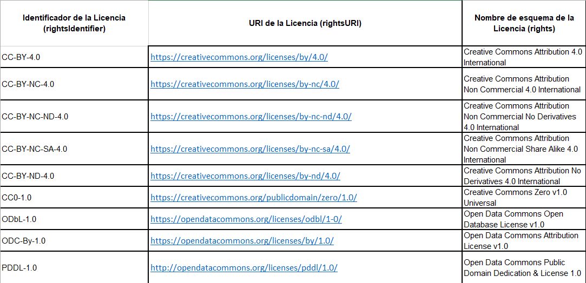

.. _Rights:

Rights (Derechos de acceso) (MA)
===========

**3.16.1. Nombre según el esquema de metadatos utilizado**

**datacite:rights**

**3.16.2. Etiqueta normalizada (Idioma Español)**

**3.16.3. Definición y alcance de la propiedad**

Se describen las condiciones de acceso al recurso según su contenido así como información sobre el tipo de acceso o derecho que va a tener el recurso. Si los metadatos describen más de un recurso, por ejemplo, texto completo y material complementario, se debe proporcionar como mínimo la información de los derechos de acceso del recurso principal.

Generalmente los derechos de acceso se representan mediante una licencia asociada la cual deberá contener los derechos de autor y de propiedad intelectual definidos por la institución, de igual forma derechos de uso y reutilización del recurso.

**3.16.4. Niveles de persistencia (M/MA/R/O)**

Obligatorio cuando sea aplicable (MA)

**3.16.5. Niveles de ocurrencia (R / NR)**

Repetible (R): 0-n veces

**3.16.6. Propiedades, atributos y especificadores**

-   **Propiedad Principal Lista de Derechos de Acceso (rightsList) (MA, 0-n):** Describa cualquier información de derechos para este recurso.La propiedad puede repetirse para registrar características complejas de derechos.

-   **SubPropiedad Derechos de Acceso (rights)(MA, 1-n):** Proporcione una declaración de gestión de derechos para el recurso o haga referencia a un servicio que proporcione dicha información. Incluya información sobre el embargo si corresponde.

    -   **Atributo URI (rightsURI) (R, 0-1):** La URI proporciona la ubicación donde se puede leer la licencia. En el caso de utilizar licencias del tipo "Creative Commons", el tipo de licencia se puede reconocer directamente en el nombre de la URL relacionada.

    -   **Atributo Identificador de la Licencia (rightsIdentifier) (O, 0-1):** Contiene una versión corta y estandarizada del nombre de la licencia.

    -   **Atributo Nombre de esquema de la Licencia (rightsIdentifierScheme)(O,0-1):** Contiene el nombre del esquema de licencias utilizado.

    -   **Atributo URI del Esquema de la licencia (schemeURI)(O,0-1):** URI asociada al esquema indicado en el atributo **rightsIdentifierScheme** que puede ser legible por máquinas.

**3.16.7. Forma de descripción recomendada**

-   Use el título completo de una licencia e incluya la información de la versión si corresponde. Puede utilizarse para licencias de software.

-   Para el ingreso de valores asociados a los atributos **rights, rightsURI,** **rightsIdentifier,** se recomienda utilizar los valores del listado de licencias SPDX ([[https://spdx.org/licenses/]{.ul}](https://spdx.org/licenses/)) y cuyos principales valores se muestran a continuación:

   
Descargar Tabla [#]_ :download:`xlsx <_Downloads/3.16.7. Forma de descripción recomendada.xlsx>`

-   Como un complemento a la licencia, se recomienda agregar en una ocurrencia de la propiedad **rights,** la información asociada a los niveles de acceso del recurso, los cuales se construyen utilizando el vocabulario controlado de COAR **"Access Rights"**

..
+-------------------------------------+--------------------------------------------+
|Identificador de la Licencia (rights)| URI de la Licencia (rightsURI)             |
+-------------------------------------+--------------------------------------------+
| embargoed access                    | http://purl.org/coar/access_right/c_f1cf   |
+-------------------------------------+--------------------------------------------+
| metadata only access                | http://purl.org/coar/access_right/c_14cb   |
+-------------------------------------+--------------------------------------------+
| open access                         | http://purl.org/coar/access_right/c_abf2   |
+-------------------------------------+--------------------------------------------+
| estricted access                    | http://purl.org/coar/access_right/c_16ec   |
+-------------------------------------+--------------------------------------------+
..

**3.16.8. Equivalencias Dublin Core**

-   dc.rights

-   dc.rights.accessrights

-   dc.rights.licence

**3.16.9. Ejemplos (XML y DATAVERSE)**

-   **Ejemplo XML**

..
+-------------------------------------------------------------------------------------------------------------+
|<rightsList>                                                                                                 |
|  <rights xml:lang="en-US"                                                                                   |
|     schemeURI="https://spdx.org/licenses/"                                                                  |
|     rightsIdentifierScheme="SPDX"                                                                           |
|     rightsIdentifier="CC0 1.0"                                                                              |
|     rightsURI="https://creativecommons.org/publicdomain/zero/1.0/"/>                                        |
|</rightsList>                                                                                                |
+-------------------------------------------------------------------------------------------------------------+
|<rightsList>                                                                                                 |
|<rights rightsURI="info:eu-repo/semantics/openAccess">Open Access</rights>                                   |
|<rights rightsURI="http://purl.org/coar/access_right/c_abf2">open access</rights>                            |
|<rights xml:lang="es-CO" schemeURI="https://spdx.org/licenses/" rightsIdentifierScheme="SPDX"                |
|rightsIdentifier="CC-BY-ND-4.0" rightsURI="https://creativecommons.org/licenses/by/4.0/">Creative Commons    |
|Attribution No Derivatives 4.0 International</rights>                                                        |
|<rights xml:lang="en" rightsURI="https://archaeologydataservice.ac.uk/advice/termsOfUseAndAccess">Terms of   | 
|Use and Access to ADS Resources</rights>                                                                     |
|</rightsList>                                                                                                |
+-------------------------------------------------------------------------------------------------------------+
..

-   **Ejemplo Dataverse**

..
+---------------------------------------------+
|.. image:: _static/image16_2.png             |
|   :scale: 35%                               |
|   :name: img_dataverse16_2                  |
+---------------------------------------------+
..
