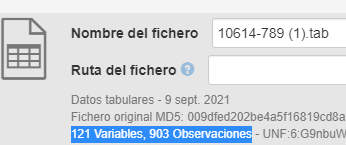

.. _Size:

Size (Tamaño) (O)
===========

**3.13.1. Nombre según el esquema de metadatos utilizado**

**datacite:size**

**3.13.2. Etiqueta normalizada (Idioma Español)**

Tamaño / Extensión del recurso

**3.13.3. Definición y alcance de la propiedad**

Información del tamaño y la extensión del recurso.

**3.13.4. Niveles de persistencia (M/MA/R/O)**

Opcional (O)

**3.13.5. Niveles de ocurrencia (R / NR)**

Repetible (R) 0-n veces

**3.13.6. Propiedades, atributos y especificadores**

-   **Propiedad Principal Tamaños (sizes) (O, 0-n):** Use la información del tamaño como valor de cada una de las propiedades asociadas al recurso.

    -   **SubPropiedad tamaño (size) (O, 0-n):** Describa el tamaño asociado según la forma de medida utilizada (Bytes, MegaBytes, Centímetros, Metros, Cantidad de filas, etc..)

**3.13.7. Forma de descripción recomendada**

-   Revise la forma adecuada para ingresar el tamaño / extensión del recurso con su debida puntuación:

    -   Indique la descripción del tamaño del recurso, incluyendo su extensión y de los materiales acompañantes.

    -   Repita la propiedad para diferentes dominios de información de tamaño.

**3.13.8. Equivalencias Dublin Core**

-   dc.format.extent

-   dc.format.size

**3.13.9. Ejemplos (XML y DATAVERSE**)

-   Ejemplo XML

..
+---------------------------------------------------------------------+
| \<sizes>                                                            |
|                                                                     |
| \<size>4 kB\</size>                                                 |
|                                                                     |
| \<size>256 pages\</size>                                            |
|                                                                     |
| \<size>4 datasets\</size>                                           |
|                                                                     |
| \<size>10000 files\</size>                                          |
|                                                                     |
| \</sizes>                                                           |
+---------------------------------------------------------------------+
..

-   Ejemplo Dataverse

