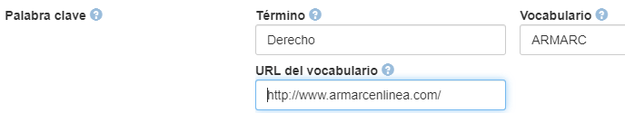
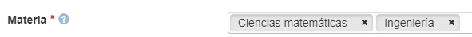

.. _Subject:

Subject (Materia)(R)
===========

**3.6.1. Nombre según el esquema de metadatos utilizado**

**datacite:subject**

**3.6.2. Etiqueta normalizada (Idioma Español)**

Palabras clave / Materia / Punto de acceso, descriptores y/o códigos de clasificación.

**3.6.3. Definición y alcance de la propiedad**

Asunto, palabra clave, tema o frase que describe al recurso. Es un punto de acceso que tiene el recurso para ser consultado por el usuario. Puede elegir palabras más significativas evitando que sea demasiado general sino más específica.

Se recomienda el uso de términos controlados localizados en tesauros o listas de encabezamientos de materias. En caso de que no estén controladas utilice el calificador de campo especial para registrar esta información.

**3.6.4. Niveles de persistencia (M/MA/R/O)**

Recomendado (R)

**3.6.5. Niveles de ocurrencia (R / NR)**

Repetible (R): 0-n veces

**3.6.6. Propiedades, atributos y especificadores**

-   **Propiedad Principal Materias (subjects) (R, 0-n):** Contiene todas las materias ó palabras claves asociados a recurso.

    -   **SubPropiedad Materia (subject)(R, 0-n):** Utilice la materia o palabra clave como valor.

        -   **Atributo IDIOMA (xml:lang) (O, 0-1):** Este atributo especifica el idioma utilizado en la descripción. Se debe tener en cuenta su codificación normalizada según el vocabulario propuesto por el estándar ISO 639-3 utilizando carácteres en UTF-8 (https://iso639-3.sil.org/code_tables/download_tables**)**

        -   **Atributo Nombre del lenguaje documental (subjectScheme) (O, 0-1):** Nombre del esquema de materia o código de clasificación o autoridad. Se deben tener en cuenta el siguiente o vocabulario controlado propuesto:

..
                
        +-------------------------+---------------------------------------+-------------------------------------------+
        | Vocabulario Normalizado | Descripción del                       | URI del Esquema                           |
        | (nameIdentifierScheme)  | Atributo                              | (schemeURI)                               |
        +=========================+=======================================+===========================================+
        |  AGROVOC                | Vocabulario controlado de agricultura | https://agrovoc.fao.org/                  |
        +-------------------------+---------------------------------------+-------------------------------------------+
        |  ARMARC                 | Archivo en línea de autoridades       | http://www.armarcenlinea.com/             |
        |                         | de materia                            |                                           |
        +-------------------------+---------------------------------------+-------------------------------------------+
        |  CLASSIFICATION         | Esquema de clasificación local        |                                           |
        +-------------------------+---------------------------------------+-------------------------------------------+
        |  DDC                    | Clasificación Decimal Dewey           | http://dewey.info/                        |
        +-------------------------+---------------------------------------+-------------------------------------------+
        |  DECS                   | Descriptores en ciencia de la salud   | http://decs.bvs.br/                       |
        +-------------------------+---------------------------------------+-------------------------------------------+
        |  ECM                    | Catálogo de unión de autoridades de   | http://librunam.dgbiblio.unam.mx          |
        |                         | materia de México DGB/UNAM            |                                           |
        +-------------------------+---------------------------------------+-------------------------------------------+
        |  JEL                    | Códigos de clasificación en economía  | http://www.aeaweb.org/econlit/jelCodes.php|
        |                         |                                       |                                           |
        +-------------------------+---------------------------------------+-------------------------------------------+
        |  LCC                    | Clasificación de la Biblioteca del    | http://www.loc.gov/catdir/cpso/lcco/      |
        |                         | Congreso de EE.UU                     |                                           |
        +-------------------------+---------------------------------------+-------------------------------------------+
        |  LCSH                   | Listado de encabezamiento de materias |                                           |
        |                         | de la Biblioteca del Congreso de EE.UU|                                           |
        +-------------------------+---------------------------------------+-------------------------------------------+
        |  LEM                    | Listado de encabezamiento de materias |                                           |
        |                         | de la Biblioteca Nacional de España   |                                           |
        +-------------------------+---------------------------------------+-------------------------------------------+
        |  LEMB                   | Listado de encabezamiento de materias |                                           |
        |                         | para Biblioteca Luis Angel Arango     |                                           |
        +-------------------------+---------------------------------------+-------------------------------------------+
        |  MESH                   | Lista de términos en temas            |                                           |
        |                         | médicos                               |                                           |
        +-------------------------+---------------------------------------+-------------------------------------------+
        |  OCDE                   | Lista de términos en desarrollo       |                                           |
        |                         | económico y social                    |                                           |
        +-------------------------+---------------------------------------+-------------------------------------------+
        |  OTHER                  | Otros Vocabularios                    |                                           |
        +-------------------------+---------------------------------------+-------------------------------------------+
        |  PROPOSAL               | Descriptores Propuestos No            |                                           |
        |                         | normalizados                          |                                           |
        +-------------------------+---------------------------------------+-------------------------------------------+
        |  SPINES                 | Tesauro Spines                        |                                           |
        +-------------------------+---------------------------------------+-------------------------------------------+
        |  TEE                    | Tesauro europeo de Educación          |                                           |
        +-------------------------+---------------------------------------+-------------------------------------------+
        |  UDC                    | Clasificación Decimal Universal       |                                           |
        +-------------------------+---------------------------------------+-------------------------------------------+
        |  UNESCO                 | Tesauro multidisciplinario            |                                           |
        +-------------------------+---------------------------------------+-------------------------------------------+
 
 ..  
  
  
-   **Atributo URI (schemeURI) (O, 0-1):** URI del esquema identificador del vocabulario controlado cuando este lo posee. En este campo se puede colocar la URL de acceso al vocabulario controlado en Internet.

-   **Atributo URI (valueURI) (O, 0-1):** Este atributo permite almacenar la URI del término utilizado en el caso que esté disponible y se encuentre construido con una ontología ó utilizando enlaces de Linked Open Data (LOD).

-   **Atributo Código de clasificación (classificationCode) (O, 0-1):** Este atributo permite almacenar el código de clasificación del término utilizado en el caso que esté disponible y se encuentre construido con una ontología ó utilizando enlaces de Linked Open Data (LOD).

**3.6.7. Forma de Descripción Normalizada (RDA / RCAA2 / ISBD)**

Se recomienda utilizar términos tomados de un esquema de clasificación estándar. Codifique cada término usando los atributos adicionales de la propiedad del sujeto (Nombre del lenguaje documental, Esquema y URL del Esquema ). Utilice el uso de mayúsculas y puntuación tal cual como aparece en el esquema original.

**3.6.8. Equivalencias Dublin Core**

-   dc.subject

-   dc.subject.agrovoc

-   dc.subject.armarc

-   dc.subject.bne

-   dc.subject.cab

-   dc.subject.classification

-   dc.subject.ddc

-   dc.subject.decs

-   dc.subject.ecm

-   dc.subject.eric

-   dc.subject.ilo

-   dc.subject.jel

-   dc.subject.lcc

-   dc.subject.lcsh

-   dc.subject.lem

-   dc.subject.lemb

-   dc.subject.mesh

-   dc.subject.ocde

-   dc.subject.other

-   dc.subject.proposal

-   dc.subject.spines

-   dc.subject.tee

-   dc.subject.udc

-   dc.subject.unesco

3.6.9. Ejemplos (XML y DATAVERSE)

-   **Ejemplo XML**

+-----------------------------------------------------------------------+
| **\<subjects>**                                                       |
|                                                                       |
| > **\<subject xml:lang=\"en\"                                         |
| > schemeURI=\"https://lccn.loc.gov/sh85062931\"                       |
| > subjectScheme=\"LCCN\"\>Temperature\</subject>**                    |
| >                                                                     |
| > **\<subject xml:lang=\"en\"                                         |
| > schemeURI=\"https://lccn.loc.gov/sh85133712\"                       |
| > subjectScheme=\"LCCN\"\>Humidity\</subject>**                       |
| >                                                                     |
| > **\<subject xml:lang=\"en\"\>Ponhook Lake (N.S.)\</subject>**       |
|                                                                       |
| **\</subjects>**                                                      |
+-----------------------------------------------------------------------+
|\<subjects>                                                            |
|  <subjects xml:lang="es-US" schemeURI=https://http//dewey.info/       |
|  subjectScheme="dewey">000 computer science</subject>                 |
|\</subject>                                                            |
+-----------------------------------------------------------------------+
| \<subjects>                                                           |
|                                                                       |
| > \<subject xml:lang=\"en\"\>Fertility\</subject>                     |
| >                                                                     |
| > \<subject xml:lang=\"en\"\>Marriage\</subject>                      |
| >                                                                     |
| > \<subject xml:lang=\"en\"\>Germany\</subject>                       |
| >                                                                     |
| > \<subject xml:lang=\"en\"\>Data validation\</subject>               |
| >                                                                     |
| > \<subject xml:lang=\"en\"\>Mikrozensus\</subject>                   |
| >                                                                     |
| > \<subject xml:lang=\"en\"\>Gender survey\</subject>                 |
| >                                                                     |
| > \<subject xml:lang=\"en\"                                           |
| > schemeURI=\"https:                                                  |
| //gesis.org/en/services/research/tools-for-searching/classification\" |
| > subjectScheme=\"GESIS\" classificationCode=\"10300\"\>Demography,   |
| > Population Research\</subject>                                      |
|                                                                       |
| \</subjects>                                                          |
+-----------------------------------------------------------------------+

-   **Ejemplo Dataverse Término normalizado**

-   **Ejemplo DataVerse Término propuesto**

