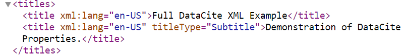
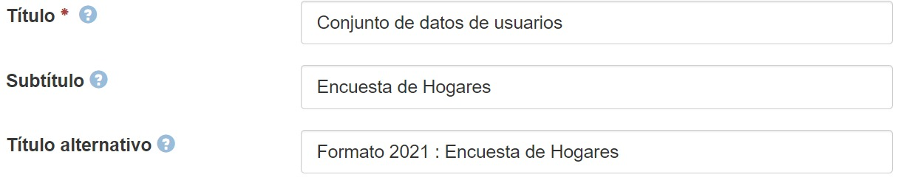

.. _Title:

Title (Título) (M)
===========

**3.3.1. Nombre según el esquema de metadatos utilizado**

**datacite:title**

**3.3.2. Etiqueta normalizada (Idioma Español)**

Título (Título propiamente dicho)

**3.3.3. Definición y alcance de la propiedad**

Texto libre que contiene el nombre del recurso o variantes del mismo con el que es conocido/utilizado. Se debe transcribir el título del recurso original, en orden y ortografía presente. Los subtítulos deben separarse del título mediante dos puntos, precedidos y seguidos por un espacio.

**3.3.4. Niveles de persistencia (M/MA/R/O)**

Obligatorio (M)

**3.3.5. Niveles de ocurrencia (R / NR)**

Repetible (R): 1-n veces.

**3.3.6. Propiedades, atributos y especificadores**

-   **Propiedad Principal Títulos (titles) (M, 1-n):** Contiene todos los títulos por los cuales es reconocido el recurso

    -   **SubPropiedad Título (title) (M, 1-n):** Utilice el nombre del título como valor

        -   **Atributo IDIOMA (xml:lang) (O, 0-1):** Este atributo especifica el idioma asociado al tipo de título que se describe. Se debe tener en cuenta su codificación normalizada según el vocabulario propuesto por el estándar ISO 639-3 utilizando caracteres en UTF-8 (https://iso639-3.sil.org/code_tables/download_tables)

        -   **Atributo Tipo de Título (titleType) (O, 0-1):** Este atributo permite especificar el tipo de título que se describe en el campo de metadatos. Se debe tener en cuenta los siguientes tipos de título y su codificación normalizada según el vocabulario controlado propuesto:

  
        ..
                
                +-------------------------+-------------------------------------------------+
                | Vocabulario Normalizado | Descripción                                     |
                +=========================+=================================================+
                | AlternativeTitle        | Título Alternativo / Variantes del Título       |
                +-------------------------+-------------------------------------------------+
                | Subtitle                | Subtítulo (Recomendado unificar en Título:      |
                |                         | Subtítulo)                                      |
                +-------------------------+-------------------------------------------------+
                | TranslatedTitle         | Título Traducido                                |
                +-------------------------+-------------------------------------------------+
                | Other                   | Otros Títulos                                   |
                +-------------------------+-------------------------------------------------+
        ..
  

**3.3.7. Forma de Descripción Normalizada (RDA / RCAA2 / ISBD)**

-   **Título:** Ingrese el título del recurso, la primera letra en mayúscula y finaliza con punto. Ej: Acuerdos de paz en Colombia.

-   **Subtítulo:** Seguido del título principal del recurso colocar «espacio : espacio» e ingrese el subtítulo. Ejemplo: Acuerdos de paz en Colombia : una mirada al conflicto armado

**3.3.8. Equivalencias Dublin Core**

dc.title

dc.title alternative

dc.title translated

dc.title abbreviated

dc.title former

dc.title other

**3.3.9. Ejemplos (XML y DATAVERSE)**

-   **Ejemplo XML**

-   **Ejemplo Dataverse**

