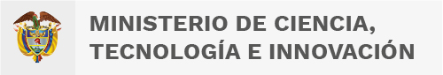

.. image:: _static/LogoRedColNaranja.png
   :scale: 35%
   :name: img_header

########################################################################################################################
Directrices de Metadatos para Repositorios de Datos de Investigación de la Red Colombiana de Información Científica  -RedCol-
########################################################################################################################

..

Red Colombiana de Información Científica (RedCol) - http://redcol.minciencias.gov.co/ 
=====================================================================================

..

.. toctree::
   :numbered:
   :maxdepth: 1

   presentacion.rst
   use_of_oai_pmh.rst
   prueba.rst
   normatividadInter.rst
   interoperabilidad.rst
   descGenPer.rst
   vocabulario.rst
   glosario.rst
   anexos.rst
   bibliografia.rst
   controlcambios.rst   

